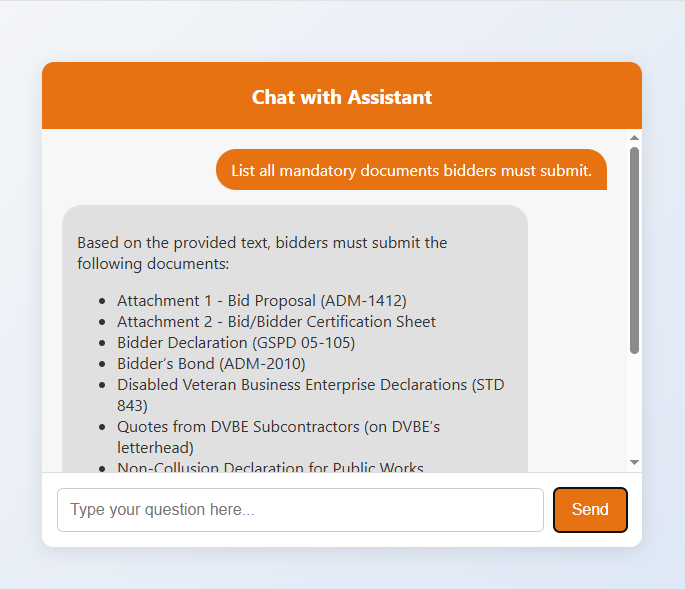
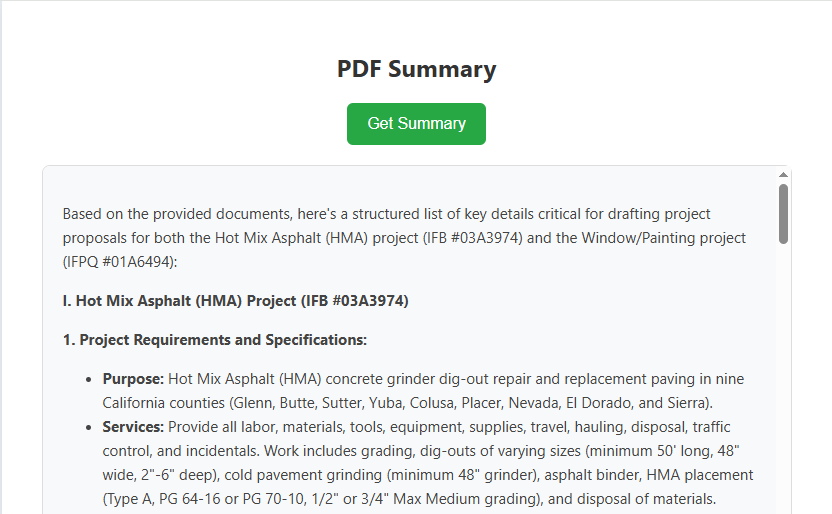

# Project Proposal Assistant :

This is a lightweight, production-style MVP designed to help users **generate project proposal summaries** and **interactively query PDF documents** using a Retrieval-Augmented Generation (RAG) pipeline powered by the **Gemini API**.

---

## 🚀 Features

- 📄 Extracts "fine-prints" — key project details — from PDFs.
- 💬 Provides a chatbot interface for querying documents contextually.
- ⚡ Built with FastAPI, LangChain, and Gemini for rapid and smart document analysis.
- 🖥️ Clean, responsive HTML interface using vanilla HTML/CSS.


## 🛠️ Setup Instructions

### 1. Clone the Repository
```bash
git clone https://github.com/nairutyaiitp/fineprints-rag-app
cd fineprints-rag-app
```

### 2. Create a Virtual Environment
```bash
conda create -n proposal_assistant python=3.10 -y
conda activate proposal_assistant
```

### 3. Install Dependencies
```bash
pip install -r requirements.txt
```

### 4. Setup Gemini API Key
Create a `.env` file in the root directory:
```env
GEMINI_API_KEY=your_gemini_api_key_here
```
### 5. Run the App
```bash
python app.py
```

### 6. Access the App
- Main UI: [http://127.0.0.1:8000](http://127.0.0.1:8000)
---


## Output Files

- `chat_response.txt` — Responses to sample questions using `/chat`
- `fine_prints.txt` — Output from `/fine-prints` endpoint
---
## 🔍 Preview

### Chatbot Interface


### Fine Prints Summary Page



## Author
Built by Nairutya Patel.

---
